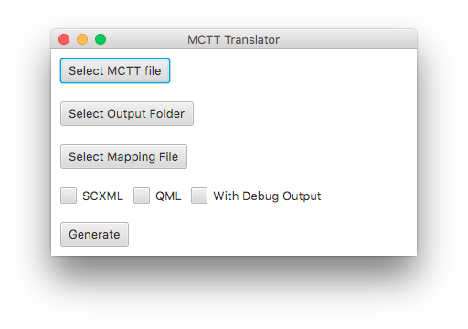
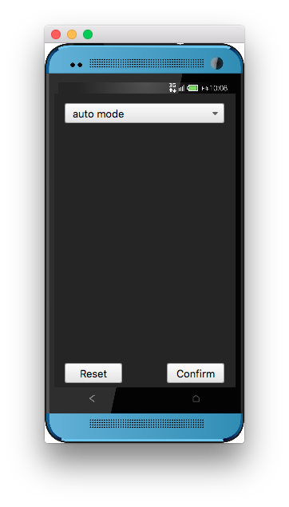

# MCTT
This is the github repository of the multi-device CTT (MCTT) extension toolchain. MCTT is an approach for modeling multi-device user interactions based on task models. We use [ConcurTaskTrees (CTTs)](https://www.w3.org/2012/02/ctt/) as a domain-specific language, which we extend by a labeling mechanism to model multi-device interactive applications. The MCTT toolchain is based on the Qt toolkit and Scala for generating code for distributed UIs. This includes a mapping from high-level tasks to concrete UI controls and a distributed execution model based on state machines.

# License
This project is published under the Eclipse Public License 1.0.

# How to build
The toolchain consists of two major components, the MCTT-Translator which generates state machines from abstract MCTT specifications and a simulation environment which allows the user to run the (simulated) devices.

## Building and running the MCTT-Translator
The MCTT generator is implemented in Scala. It's sourcecode is located in the `MCTT-Translator` directory. As a prerequisite, bot the latest Scala distribution and the Scala Build Tool (SBT) must be installed. The following commands build and run the MCTT-Translator GUI:
```
cd MCTT-Translator
sbt run
```
If the build step completed without errors, you should see something like this:


A sample MCTT file is located at `Samples/scenario1/scenario1_mctt.txt`. Further, an output folder must be specified and a mapping file must be provided (a mapping file for sample scenario 1 can be found at `Samples/scenario1/mapping_scenario1.txt`). We can specify if we want to generate SCXML files and/or QML files (needed for the simulation environment). The SCXML files visualize the generated state machines and can be viewed with e.g. the [scxmlgui](https://github.com/fmorbini/scxmlgui).

## Building the simulation environment
The simulation environment consists of a server and client component. Both are written in C++ and use the Qt framework with QML/QtQuick. It is therefore necessary to have Qt installed (minimum version 5.5). The applications can be built with CMake. Note that `CMAKE_PREFIX_PATH` must point to your Qt installation:
```
export CMAKE_PREFIX_PATH = <path_to_Qt> 
```
It is further required to create a build directory for both the MCTTClient and MCTTBroadcastServer project, e.g. `Simulation-Environment/MCTTBroadcastServer-build` and `Simulation-Environment/MCTTClient-build`.

Building the projects then reduces to a simple two step process. The following commands must be executed in `Simulation-Environment/MCTTBroadcastServer-build`:
```
cmake ../MCTTBroadcastServer
make 
```
If no errors appeared, the application has been successfully built. Repeat the above steps for `MCTTClient`.

# Running the samples
We provide two sample scenarios to test and tinker with the simulation environment. The required files are located in `Samples/scenario1` and `Samples/scenario2` respectively. The folling steps describe how to run scenario 1.

## Start server
First of all, the server component must be started:
```
<path_to_simulation_environment>/MCTTBroadcastServer-build/MCTTBroadcastServer
```
Per default, the server is hosted at `localhost:9000`. You can specify a binding address and a custom port via `--server` and `--port` command line arguments.

## Start clients
Scenario 1 has two devices, a (simulated) smartphone and a (simulated) microwave. For both devices we have to start a distinct `MCTTClient` and tell it where to find the model files and a reference to the other device. The following command starts the smartphone:
```
<path_to_simulation_environment>/MCTTClient-build/MCTTClient --model ../../Samples/scenario1/SPModel.qml --proxies mwproxy
``` 
It automatically connects to `localhost:9000`. If you want to specify a different server location, provide the information via `--server` and `--port` command line arguments. As a result, the MCTTClient with the smartphone interface starts and you should see something like this:


The following command starts the microwave:
```
<path_to_simulation_environment>/MCTTClient-build/MCTTClient --model ../../Samples/scenario1/MWModel.qml --proxies spproxy
``` 
This results in the following microwave interface:


Both client instances automatically connect to the server and initialize their state machines. You can now press a button on any of the device and see the corresponding reactions on both devices.

# Publications